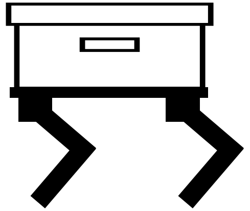

# ShoeBot_Pi 

&nbsp;
&nbsp;
_Democratizing robotics, one shoebox at a time_

The ShoeBot framework is an open-source platform designed to make learning about and development of mobile robotic systems accessible, modular, and affordable.

## Overview
This repository contains specifically the code to be ran on the raspberry pi acting as the central controller for the system. 

For hardware files as well as the code to run on the peripheral pico controllers for each module, check out the [main repository](https://github.com/tyler-bartunek/ShoeBot).
For the project documentation, please refer to the [wiki](https://github.com/tyler-bartunek/ShoeBot/wiki)

## License Information
This repository, alongside almost all content in this project unless otherwise noted, is licensed under the [Apache License-2.0](License.md).
